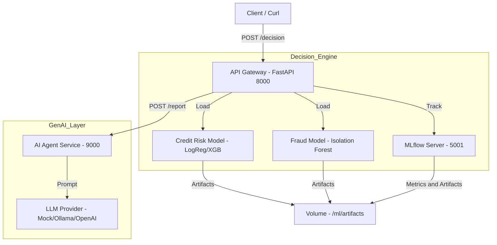

# Sentinelle - Guide de Démonstration ("Walkthrough")

> **Pitch Recruteur :**
> *   🚀 **What you can demo in 2 minutes**: Un moteur de décision end-to-end intégrant ML supervisé (Crédit), détection d'anomalies (Fraude), et explicabilité générative par Agent IA.
> *   🛡️ **Why it matters**: Architecture conforme "AI Act" avec auditabilité complète (MLflow), versions de modèles tracées, et supervision humaine.
> *   🔁 **How to reproduce**: `docker compose up` et c'est parti.

Ce document détaille l'architecture et les étapes pour démontrer les capacités de la **Sentinelle**. Ce projet simule un moteur de décision bancaire moderne, "production-ready", intégrant ML supervisé, détection d'anomalies, MLOps et IA Générative.

## 🏗️ Architecture du Système

Le système est composé de 3 microservices orchestrés par Docker :



---

## 🚀 Quick Start

### 1. Démarrer la stack complète
```bash
docker compose up -d --build
```

- **API** : [http://localhost:8000/docs](http://localhost:8000/docs)
- **MLflow** : [http://localhost:5001](http://localhost:5001)
- **Agent** : [http://localhost:9000/health](http://localhost:9000/health)

**(Optionnel) Vérifier rapidement :**
```bash
curl -s http://localhost:8000/docs >/dev/null && echo "API OK"
curl -s http://localhost:9000/health && echo ""
curl -s http://localhost:5001 >/dev/null && echo "MLflow OK"
```

### 2. Entraîner les modèles (si nécessaire)
Le système est livré avec des scripts d'entraînement robustes qui génèrent les modèles et les métriques MLflow.

```bash
pip install -r ml/requirements.txt
export MLFLOW_TRACKING_URI=http://localhost:5001

# Entraîne le modèle de Risque Crédit (Supervisé)
python ml/training/train_credit_risk.py

# Entraîne le modèle de Fraude (Non-supervisé)
python ml/training/train_fraud.py
```

---

## 🧪 Scénarios de Démonstration (Curl)

Utilisez les fichiers d'exemples JSON fournis dans `examples/` pour tester les différents comportements du moteur.

### Cas 1 : ✅ Dossier Solide (ACCEPT)
*Profil : 34 ans, CDI, bons revenus, faible endettement.*

```bash
curl -X POST "http://localhost:8000/decision" \
  -H "Content-Type: application/json" \
  -d @examples/accept.json
```
**Attendu** : `"decision": "ACCEPT"`, `risk_score` faible (< 0.4), `report_summary` positif.

---

### Cas 2 : ❌ Haut Risque Crédit (REJECT)
*Profil : 22 ans, Sans emploi, Endettement élevé (60%), Retards de paiement.*

```bash
curl -X POST "http://localhost:8000/decision" \
  -H "Content-Type: application/json" \
  -d @examples/reject.json
```
**Attendu** : `"decision": "REJECT"`, `risk_score` élevé (> 0.7), `report_summary` expliquant le refus (dette, emploi).

---

### Cas 3 : 🚨 Suspicion de Fraude (ALERT)
*Profil : Client moyen MAIS transaction anormale (Électronique, nuit, nouvel appareil, loin du domicile).*

```bash
curl -X POST "http://localhost:8000/decision" \
  -H "Content-Type: application/json" \
  -d @examples/alert.json
```
**Attendu** : `"decision": "ALERT"`, `fraud_score` élevé (proche de 1.0), `report_summary` mentionnant l'anomalie transactionnelle.

---

## 📊 Exploration MLOps
1. Accédez à **MLflow** sur [http://localhost:5001](http://localhost:5001).
2. Ouvrez l'expérience **credit-risk**.
3. Cliquez sur un Run pour voir :
   - **Metrics** : AUC, Recall, Default Rate.
   - **Artifacts** : Le fichier `model.joblib` et `metrics.json` archivés.

## 📄 Documentation
La documentation complète et bilingue du projet est disponible dans :
- [`README.md`](../README.md) : Vue d'ensemble technique.
- [`MODEL_CARD.md`](MODEL_CARD.md) : Détails des modèles ML.
- [`DATA_SHEET.md`](DATA_SHEET.md) : Description des données.
- [`AI_COMPLIANCE.md`](AI_COMPLIANCE.md) : Conformité AI Act / RGPD.
